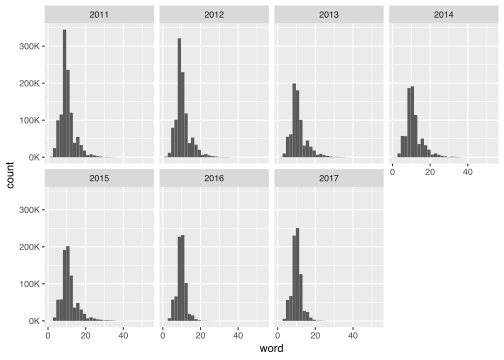
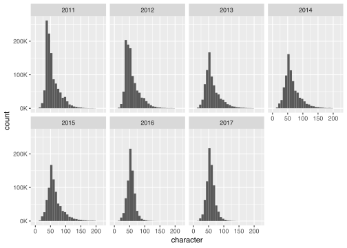
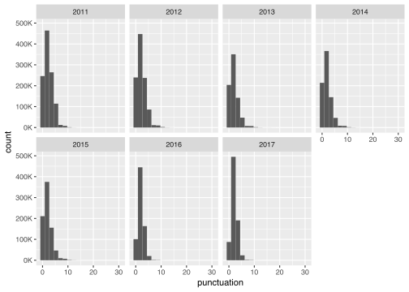
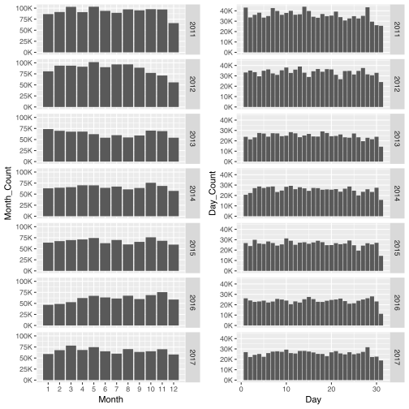
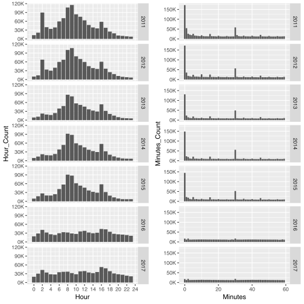
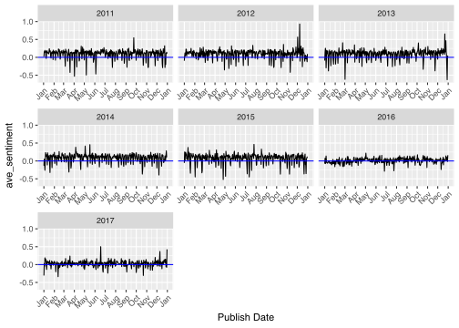

News - Text Analysis (Topic - Natural Disasters)
================
Raju Rimal
20/04/2018

This kernal provides a walkthrough of text analysis of Reuter’s
Headlines published in 2017. It includes exploration, feature
engineering, and visualization of headlines data as well as a detailed
text-analysis of disaster related headlines of 2017.

# Dataset Preparation

Load the required libraries and data. In this notebook, I am only using
the data of 2017 but the same can be extended to other years.

**Load Packages:**

``` r
library(tidyverse)
library(tidytext)
library(sentimentr)
library(magrittr)
library(lubridate)
```

**Some custom functions:**

``` r
k_scale <- function(x) paste0(round(x/1000), "K")
```

**Lets look at the dataset:**

``` r
if (file.exists("data/newswire.feather")) {
  dta <- feather::read_feather("data/newswire.feather")
} else {
  if (file.exists("data/newswire.feather")) {
    dta <- feather::read_feather("data/newswire.feather")
  } else {
    files <- dir("data", pattern = "csv")
    dta <- map_df(files, function(file) {
      read_csv(paste0("data/", file))
    })
    
    dta <- dta %>%
      separate(publish_time,
               into = c("Year", "Month", "Day", "Hour", "Minutes"),
               sep = c(4, 6, 8, 10))
    feather::write_feather(dta, "_data/newswire.feather")
  }
}
```

# Feature Engineering

The available data contains only two columns - headline\_text and
publish date. In this section we will create some some additional
features using these features. Following list explains different ideas
for creating new features.

## Statistical Count Features from headline text

1)  **Word Count** - Total number of words in the headline
2)  **Character Count** - Total number of characters in the headline
    excluding spaces
3)  **Word Density** - Average length of the words used in the headline
4)  **Punctuation Count** - Total number of punctuations used in the
    headline
5)  **Upper-Case to Lower-Case Words ratio** - ratio of upper case words
    used and lower case words used in the text

## Headline Text Features

1)  **Sentiment**: Polarity - sentiment value of the headline computed
    using textblob package
2)  **Part of Speech**: Nouns to Verbs Ratio - ratio of nouns and verbs
    used in the text

## Features from headline’s publish time

1)  **Month** - name of the month in which headline was publised
2)  **Date** - month date in which headline was published
3)  **Hour** - hour value in which headline was published
4)  **Minute** - minute value in whcih headline was published
5)  **Weekday** - Weekday name when the headline was published

# Generate Statistical Count Features

``` r
newswire <- feather::read_feather("data/newswire_counts.feather")
```

``` r
if (file.exists("data/newswire_counts.feather")) {
  feather::read_feather("data/newswire_counts.feather")
} else {
  newswire <- dta %>%
  mutate(
    word              = map_int(strsplit(headline_text, split = " "), length),
    character         = nchar(gsub(" ", "", headline_text)),
    avg_word_length   = character / word,
    word_density      = word / (character + 1),
    punctuation       = nchar(gsub("[^[:punct:]]", "", headline_text)),
    upper             = nchar(gsub("[^[:upper:]+]", "", headline_text)),
    lower             = nchar(gsub("[^[:lower:]+]", "", headline_text)),
    ul_ratio          = upper / lower
  )
  feather::write_feather(with_counts, "data/newswire_counts.feather")
}
```

# Exploratory Analysis

In this section, we will explore the dataset and the features

  - Headline’s Word Count Distribution over the year
  - Headline’s Character Count Distribution over the year
  - Headline’s Average Word Density Distribution over the year
  - Headline’s Punctuation Count distribution over the year
  - Publish Date Parameters distribution - Month, Month-Date
  - Publish Date Parameters distribution - Week-Day, Hour
  - WeekDay vs WeekEnd distributions 3.8. Sentiment over Time
  - Top Positive vs Top Negative Words Used in the headlines
  - Countries Visualization

## Word count distribution

``` r
my_scale <- function(x) paste0(round(x/1000), "K")
dta <- newswire
dta %>% 
  ggplot(aes(word)) +
  geom_histogram() +
  facet_wrap(~ Year, ncol = 4) +
  scale_y_continuous(labels = my_scale)
```



## Character Count Distribution

``` r
dta %>% 
  ggplot(aes(character)) +
  geom_histogram() +
  facet_wrap(~ Year, ncol = 4) +
  scale_y_continuous(labels = my_scale)
```



## Word Density distribution

``` r
dta %>% 
  ggplot(aes(word_density)) +
  geom_histogram() +
  facet_wrap(~ Year, ncol = 4) +
  scale_y_continuous(labels = my_scale)
```


## Punctuation count distribution

``` r
dta %>% 
  ggplot(aes(punctuation)) +
  geom_histogram(bins = 18) +
  facet_wrap(~ Year, ncol = 4) +
  scale_y_continuous(labels = my_scale)
```



## Distribution of headlines in different months and month-date

``` r
p1 <- dta %>% 
  group_by(Year, Month) %>% 
  summarize(Month_Count = n()) %>% 
  mutate(Month = as.integer(Month)) %>% 
  ggplot(aes(Month, Month_Count)) +
  geom_bar(stat = "identity") +
  scale_x_continuous(breaks = 1:12) +
  scale_y_continuous(labels = my_scale) +
  facet_grid(Year ~ .)
p2 <- dta %>% 
  group_by(Year, Day) %>% 
  summarize(Day_Count = n()) %>% 
  mutate(Day = as.integer(Day)) %>% 
  ggplot(aes(Day, Day_Count)) +
  geom_bar(stat = "identity") +
  scale_y_continuous(labels = my_scale) +
  facet_grid(Year ~ .)
gridExtra::grid.arrange(p1, p2, ncol = 2)
```



## Distribution of headlines during Hours and Minutes

``` r
p1 <- dta %>% 
  group_by(Year, Hour) %>% 
  summarize(Hour_Count = n()) %>% 
  mutate(Hour = as.integer(Hour)) %>% 
  ggplot(aes(Hour, Hour_Count)) +
  geom_bar(stat = "identity") +
  scale_x_continuous(breaks = seq(0, 24, 2)) +
  scale_y_continuous(labels = my_scale) +
  facet_grid(Year ~ .)
p2 <- dta %>% 
  group_by(Year, Minutes) %>% 
  summarize(Minutes_Count = n()) %>% 
  mutate(Minutes = as.integer(Minutes)) %>% 
  ggplot(aes(Minutes, Minutes_Count)) +
  geom_bar(stat = "identity") +
  scale_y_continuous(labels = my_scale) +
  facet_grid(Year ~ .)
gridExtra::grid.arrange(p1, p2, ncol = 2)
```



## Sentiments Analysis

``` r
dta1 <- dta %>% 
  select(Year, Month, Day, headline_text) %>% 
  mutate(WeekDay = wday(as_date(paste(Year, Month, Day)), label = TRUE))
plt_dta1 <- dta1 %>%
  group_by(Year) %>% 
  sample_n(10000) %>%
  ungroup() %>% 
  get_sentences() %$% 
  sentiment_by(headline_text, list(Year, Month, Day))
```

``` r
plt_dta1 %>% 
  mutate(`Publish Date` = as_date(paste(Year, Month, Day))) %>% 
  ggplot(aes(`Publish Date`, ave_sentiment)) +
  geom_line() +
  geom_hline(yintercept = 0, color = "blue") +
  facet_wrap(~Year, scales = "free_x") +
  theme(axis.text.x = element_text(angle = 45, hjust = 1)) +
  scale_x_date(date_breaks = '1 month', date_labels = "%b")
```


