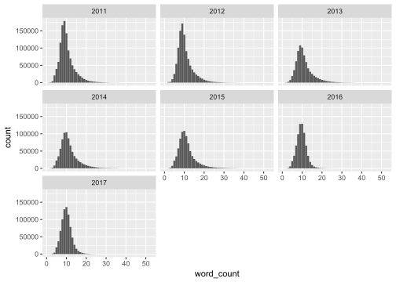
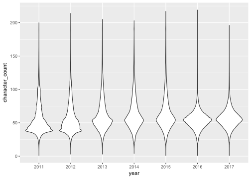
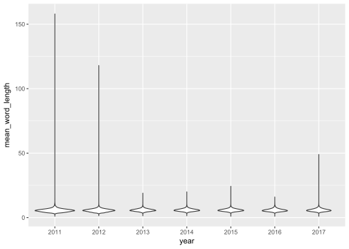
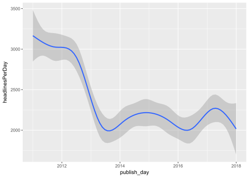
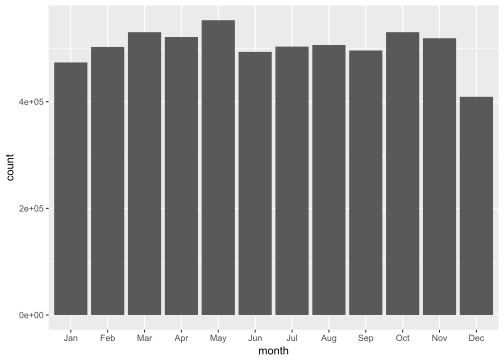
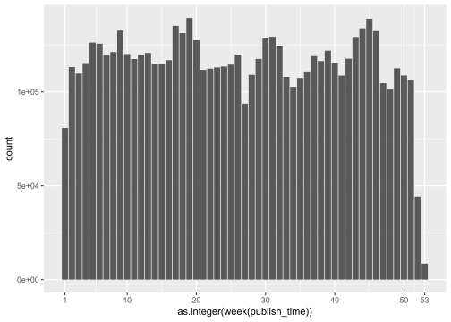
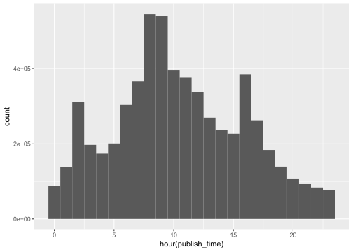
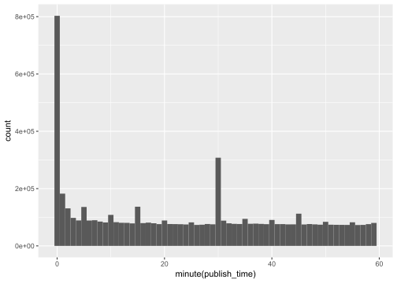

Text analysis of news headlines
================

-   [Feature engineering](#feature-engineering)
-   [Exploratory analysis](#exploratory-analysis)
    -   [Word count](#word-count)
    -   [Character count](#character-count)
    -   [Word length](#word-length)
    -   [Time distribution](#time-distribution)

``` r
reutersData <- 
  dir("data", full.names = T) %>% 
  # col_types = "cc" will read both columns as character
  # (by default the "publish_time" column would be read as integer.)
  map_df( read_csv,col_types = "cc") %>%
  # ymd_hm() will read date+time in the format [year][month][day][hour][minute]
  mutate(publish_time = ymd_hm(publish_time))
```

Feature engineering
-------------------

-   Word Count - Total number of words in the headline
-   Character Count - Total number of characters in the headline excluding spaces
-   Mean Word Length - Average length of the words used in the headline
-   Word Density - Words per character
-   Punctuation Count - Total number of punctuations used in the headline
-   Upper-Case to Lower-Case Words ratio - ratio of upper case words used and lower case words used in the text

``` r
reutersData <-
  reutersData %>% 
  mutate( word_count = map_int(strsplit(headline_text, split= " "), length) ) %>%
  # mutate( word_count2 = nchar(gsub("[^ ]","",headline_text)) + 1 ) %>% # alternative
  mutate( character_count = nchar(gsub(" ","",headline_text)) ) %>%
  mutate( mean_word_length = character_count / word_count ) %>%
  mutate( word_density = word_count / (character_count + 1) ) %>%  # +1 because... it was in the kaggle solution
  mutate( punctuation_count = nchar(gsub("[^[:punct:]]","",headline_text)) )
```

Exploratory analysis
--------------------

### Word count

``` r
reutersData %>% 
  mutate( year = year(publish_time) ) %>% 
  ggplot( aes(x=word_count) ) +
  geom_histogram(binwidth = 1) +
  facet_wrap( ~ year)
```



### Character count

``` r
reutersData %>% 
  mutate( year = factor(year(publish_time)) ) %>% 
  ggplot( aes(y=character_count, x = year) )+
  geom_violin( )
```

    ## Warning: Removed 53 rows containing non-finite values (stat_ydensity).



### Word length

``` r
reutersData %>% 
  mutate( year = factor(year(publish_time)) ) %>% 
  ggplot( aes(y=mean_word_length, x = year) ) +
  geom_violin( )
```

    ## Warning: Removed 53 rows containing non-finite values (stat_ydensity).



### Time distribution

#### Number of headlines per day over the years

``` r
reutersData %>% 
  mutate( publish_day = floor_date(publish_time, unit = "day") ) %>% 
  group_by( publish_day ) %>% 
  summarise( headlinesPerDay = n()) %>%
  ggplot( aes( x = publish_day, y = headlinesPerDay) ) +
  geom_smooth( )
```

    ## `geom_smooth()` using method = 'gam'



#### Month of the year

``` r
reutersData %>% 
  mutate( month_num = month(publish_time) ) %>%
  # convert month number to three letter abbrivation using built-in constant month.abb
  mutate( month = factor(month.abb[month_num], levels = month.abb) ) %>% 
  ggplot( aes( x = month ) ) +
  geom_bar()
```



#### Week of the year

``` r
reutersData %>% 
  ggplot( aes( x = as.integer(week(publish_time))) ) +
  geom_bar() +
  scale_x_continuous( breaks=c(1,(1:5)*10,53) )
```



#### Hour of the day

``` r
reutersData %>% 
  ggplot( aes( x = hour(publish_time)) ) +
  geom_histogram( bins = 24)
```



#### Minute of the hour

``` r
reutersData %>% 
  ggplot( aes( x = minute(publish_time)) ) +
  geom_histogram( bins = 60)
```


